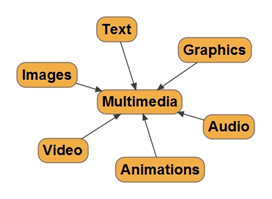
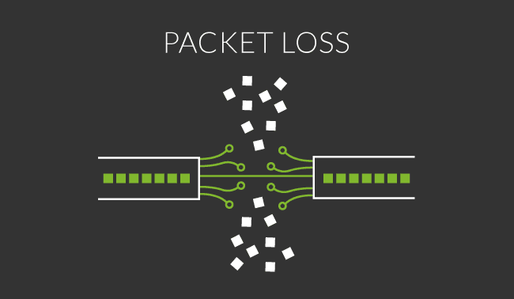

:title: Multimedia 
:data-transition-duration: 1500
:css: hovercraft.css

*MULTIMEDIA PRESENTATION*
===================================

Shivam Aggarwal - 1411073

Abhinav Handa - 1411227

Birjot Singh - 1411246

Gurnoor Singh - 1411254

----

In this presentation we are going to cover chapter: Compression , Video and Multimedia (Networking) Systems.

----

Stand Alone vs Networked Computers
=================================================

A stand alone computer is a self-sufficient system that is not connected to any other computer hence the term "stand alone." The stand alone is only used for writing memos and spreadsheets however it may also have a printer, scanner or an external hard drive attached to its CPU. The advantage of using a computer in standalone mode is that you have sole use of the machine and there are no problems with bandwidth limitations that a network may impose.

----

The Network environment is made up of two or more computers. These computers communicate with each other and share resources.  Express Technology uses the Client/Server model in a Network environment. The Client/Server model is comprised of a computer that acts as a Server to one or more computers over the network. The Server houses data and handles data requests from Client computers. Clients (Workstations) are the computers that manipulate the data sent to and from the Server. These computers run independent of the Server in all respects other than to request and send data to the SQL Server.

Depending on what the circumstances are, depends on which one you should go with.

----

SETUP
==============
The operating system install is the same for the most part with the exception of setting up the network connection. On a stand-alone computer, the operating system automatically sets up the computer. On a network computer, the computer is joined to a domain and the administrator has to specify the domain name and join the computer.

----

Security
============
Security on a network computer is different from a stand-alone computer because with network computers they have a domain security policy. This is a set of rules applied to all computers. Stand-alone computer have their own security management and firewall to help block intruders.

----

Benefits
===============
Benefits of having a stand-alone computer is that you are not bound by a separate administrator. This means the user can install programs and make all of their modifications. A benefit of having a network computer is that users do not have to manage items such as updates as these are taken care of by the administrator.

----

Multimedia Building Blocks
==============================
Multimedia Building Blocks Multimedia is a combination of various elements, such as text, images, video, sound, and animation. Interactive multimedia allows the user to control what and when the elements are delivered With the rapid changes in the field of technology, the interactive multimedia has become increasingly popular in education, business, entertainment, and public places. Has the capability of incorporating various media from text to graphics and from video to sound, is a new way to present information. 

----

Multimedia Building Blocks Diagram
========================================

----

**Using Text in Multimedia**:
Text is an essential aspect of presenting the information. Like each element of the multimedia design, effective use of text can either direct users/readers attention or divert it. 

**Using Sound in Multimedia**:
Sound is one of the most powerful elements of interactive multimedia presentation. How you use the power of sound, either linking text or image with sound, can enhance the multimedia presentation. For any computer application, such as Web pages, audio resources need to be digitized. There are some important considerations in order to do that: quality, file formats, and file size considerations; digitizing process; and understanding constraints and limitations.

----

**Using Images in Multimedia**:
Graphics are the visual elements that make up a multimedia screen. The images, such as pictures, clip art, 3-D graphics are widely used in designing for both multimedia and the Web.

**Using Animations in Multimedia**:
Using Video in Multimedia: Carefully planned and high-quality video in which one can perceive text (title), image, animation, and sound all together can make an amazing difference in an interactive multimedia product. With the digital video technology we can use the power of video for multimedia and Web delivery. 

----

Real Time Multimedia
========================

Real-time multimedia refers to applications in which multimedia data has to be delivered and rendered in real time; it can be broadly classified into interactive multimedia and streaming media. Animation, audio and video clips become increasingly popular on the Internet. A large number of distributed multimedia applications have been created, including Internet telephony, Internet videoconferencing, Internet collaboration that combines video, audio and whiteboard, Internet TV, on demand streaming or broadcasting, distance learning, distributed simulation, entertainment and gaming, multimedia messaging, etc.

----

**Interacctive Multimedia**

Interactive multimedia applications include Internet telephony, Internet video-conferencing, Internet collaboration, Internet gaming, etc. In interactive multimedia applications, the delay constraint is very stringent in order to achieve interactivity. For example, in Internet telephony, human beings can only tolerate a latency of about 250 milliseconds. This imposes an extremely challenging problem for interactive multimedia applications over the Internet that provides only the best effort service. Over the years, great efforts have been made to facilitate the development of interactive multimedia applications over the Internet.

----

**Streaming Multimedia**

Streaming media technology enables the real time or on demand distribution of audio, video and multimedia on the Internet. Streaming media is the simultaneous transfer of digital media so that it is received as a continuous real-time stream. Streamed data is transmitted by a server application and received and rendered in real-time by client applications. These client applications can start playing back audio and video as soon as enough data has been received and stored in the receiver’s buffer. There could be up to a few seconds of startup delay, i.e., the delay between when the server starts streaming the data and when the client starts the playback.

----

**Real Time Chat with Pushfyi Websocket Server**

Saas, Paas and Iaas can be used to best explain Interactive Real-time Multimedia.

----

Real-time Streaming Media Protocols
=========================================

A distortion in an image or sound caused by a limitation or malfunction in the hardware or software. Artifacts may or may not be easily detectable.

----

Multimedia Systems Architecture
=======================================

Multimedia encompasses a large variety of technologies and integration of multiple architectures interacting in real time. All of these multimedia capabilities must integrate with the standard user interfaces such as Microsoft Windows.

----

The following figure describes the architecture of a multimedia workstation environment.

----

**Network Subsystem (Layer 1)**

This layer takes care of the functionalities up layer 3 in the OSI model (Chapter 6). Network specific funstions depend on the technolgy used in this layer (see Section refsec:mmnetwork below). Essentially this level provides a possible connection through a network with a specified bandwidth and error probability as supported by the underlying technology.

**End-to-End QoS Control(Layer 2)**

This layer maintains the connection between the source and destination and can be conceptually viewed as a single connection even though there may be physically many more. Each connection is managed to ensure that a given Quality of Service (Qos) is maintained.

----

**Media Management (layer 3)**

This layer provides generic services to applications ihn so far as media management is concerned. A primary functions is synchronisation across the media.

**Application (Layer 4)**

The direct interface with the user. The applciation wil also interface with the operating system, if required. For example calls to stroage media or specific library functions (subroutines).

	
----

QoS (Quality of Service)
================================
   
On the Internet and in other networks, QoS (Quality of Service) is the idea that transmission rates, error rates, and other characteristics can be measured, improved, and, to some extent, guaranteed in advance. QoS is of particular concern for the continuous transmission of high-bandwidth video and multimedia information. Transmitting this kind of content dependably is difficult in public networks using ordinary "best effort" protocols.

----

Error Concealment
==========================

Error concealment is a technique used in signal processing that aims to minimize the deterioration of signals caused by missing data, called packet loss. A signal is a message sent from a transmitter to a receiver in multiple small packets. Packet loss occurs when these packets are misdirected, delayed, resequenced, or corrupted.

----

Causes of Packet Loss
=========================

**Link congestion**
Your data must travel through multiple devices and links during its trip across your network. If one of these links is at full capacity when your data arrives, then it must wait its turn before being sent across the wire (this is known as queuing).

----

Device Performance
=========================

Let’s take a scenario where you recently upgraded a link from 1Gb to 10Gb because traffic reports show that you were at full capacity during peak hours of the day. After the upgrade, your charts show the bandwidth going up to 1.5Gb, but you are still experiencing network performance issues. The issue could be that the device is not able to keep up with the traffic, and you have hit the maximum throughput your hardware can provide.

The traffic is reaching the device, but the device’s CPU or memory is maxed out and not able to handle extra traffic. This results in packet loss for all traffic that is beyond the capacity of the box.

----

How to fix Packet Loss?
================================

**Congested Links**: 
Increase the bandwidth of the congested link(s)

**Hardware**:
Replace the hardware with a new appliance that can handle your maximum throughput, or potentially cluster additional hardware to increase your throughput.

**Buffers**:
Data buffers are used for temporarily storing data while waiting for delayed packets to arrive. They are common in internet browser loading bars and video applications, like YouTube.

----

**Packet Repetition**
	
Packet repetition, also called forward error correction (FEC), adds redundant data, which the receiver can use to recover lost packets. This minimizes loss, but increases the size of the packet.

**Applications**

Error concealment has many digital applications, including web browsing, video conferencing, Skype, and YouTube

----

Overlay Network
=======================

An overlay network is a telecommunications network that is built on top of another network and is supported by its infrastructure. An overlay network decouples network services from the underlying infrastructure by encapsulating one packet inside of another packet. After the encapsulated packet has been forwarded to the endpoint, it is de-encapsulated.

----

:data-x: r+1500
:data-y: r-3000

Unicast and multicast streaming
======================================

Unicast and Multicast are two methods of streaming video over the Internet. Unicast is a point-to-point protocol where information is sent from one device to another. This is the primary method of sending files and information over Local Area Networks (LANs) and most of the Internet. It usually uses what is known as the Transmission Control Protocol (TCP). Device A sends the data directly to Device B. If Device C also wants the data, Device A will send the data directly to Device C, even if Device B is being sent the data separately at the same time.

----

Multicast is where information is sent once from a receiver to multiple delivery points and requires the User Datagram Protocol (UDP). UDP uses less overhead than TCP and transmits data faster. Device A sends the data out, typically to a switch. If Device B and C want the data, they “join” the switch to receive that single data stream coming from Device A. Device A does not send Device B and Device C their own signal, B and C tap into the one signal sent from A.

----

How do they work?
================================

Unicast is easy to use and usually doesn’t require anything extra to be done to a network to function. It is a method that goes from one IP address to another, so it is based on where the content is going. It is a connection protocol. If the video to be streamed is going to go to a user, it goes from the sending device to that user. If another user wants to view that video, a separate iteration of that video is sent to the second user.

----

Multicasting is what is known as a connectionless protocol. It really doesn’t care where data is sent, or if it even gets to its destination. Multicasting may require some network configuration, as special addressing must be used. The end user has chosen to receive the video before it has been streamed. The video is sent one time from the sending device and all the devices that have been set to receive the stream also get the video. Devices that are not set to receive the stream do not get that traffic. In a way it is similar to cable TV. The signal is sent out from the head end and if you have the right cable package and tune into that channel, you can get the video. If you don’t have the proper package or are on a different channel, that signal isn’t delivered to you.

----

With this, We complete my presentation.
=======================================

----

Thank you...
=============
